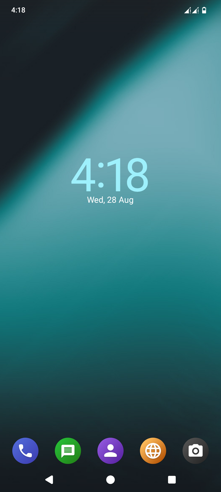
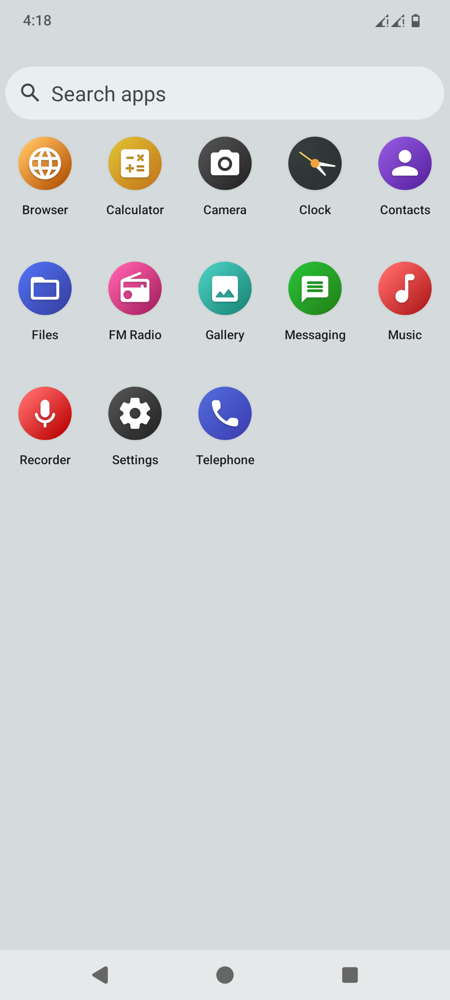
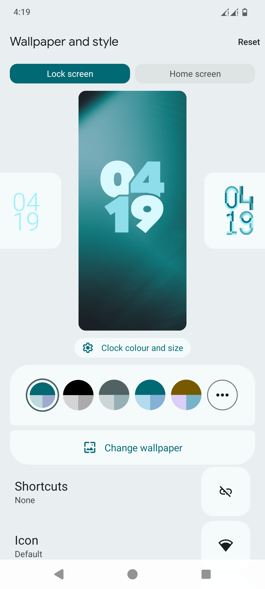
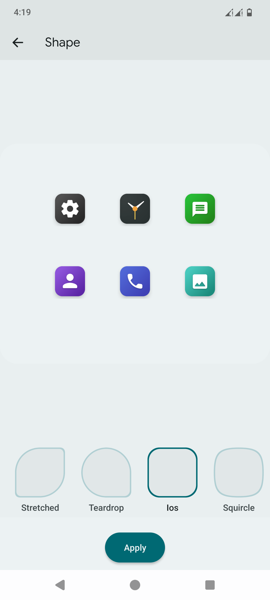
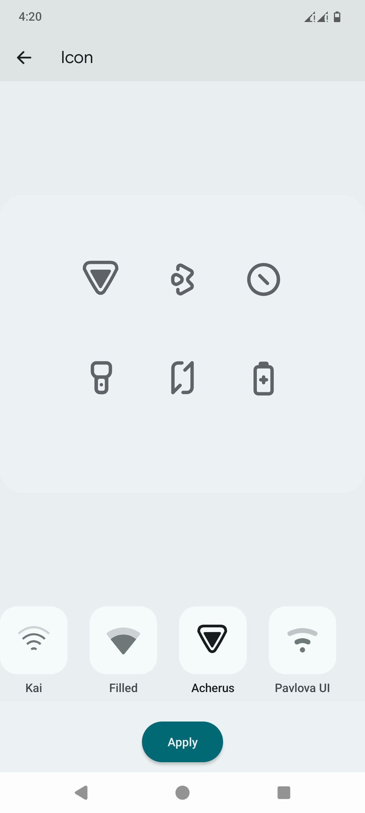
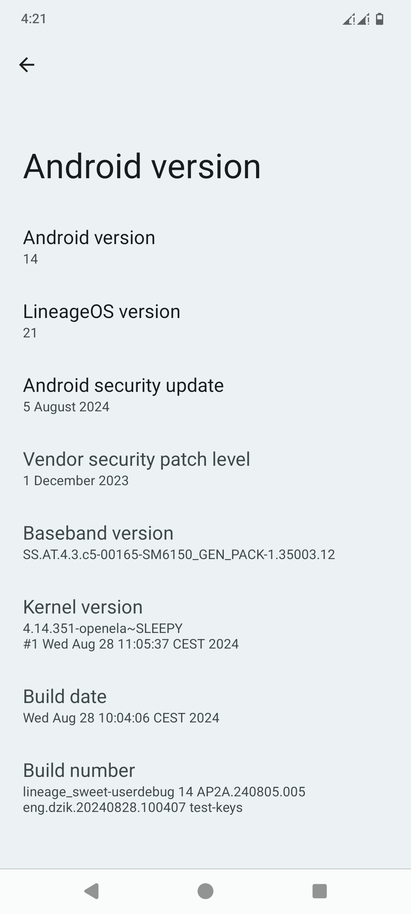
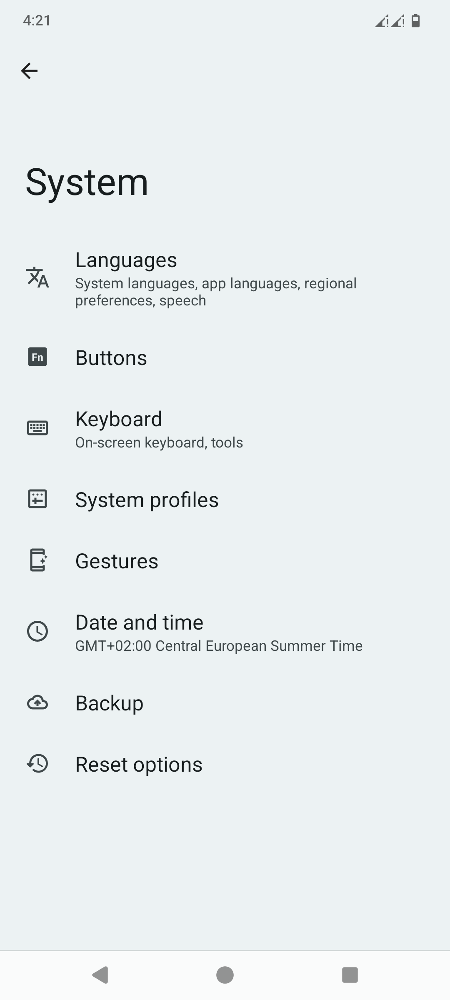
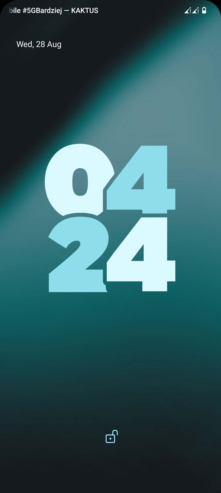

# LineageOS 21 for sweet - HOMEMADE

Wow, I actually hate android

# Screenshots

## Sources

- [LineageOS](https://github.com/LineageOS/android/tree/lineage-21.0) (synced 15 Aug 2024)

- Device tree: [LineageOS/android_device_xiaomi_sweet](https://github.com/LineageOS/android_device_xiaomi_sweet)

- Common tree: [LineageOS/android_device_xiaomi_sm6150-common](https://github.com/LineageOS/android_device_xiaomi_sm6150-common)

- Kernel (tag `v18`): [itsshashanksp/kernel_xiaomi_sm6150](https://github.com/itsshashanksp/kernel_xiaomi_sm6150)

- Vendor (sweet): [xiaomi-sm6150/proprietary_vendor_xiaomi_sweet](https://github.com/xiaomi-sm6150/proprietary_vendor_xiaomi_sweet)

- Vendor (common): [xiaomi-sm6150/proprietary_vendor_xiaomi_sm6150-common](https://github.com/xiaomi-sm6150/proprietary_vendor_xiaomi_sm6150-common)

## Changes

### UI
- more icon themes
- lockscreen clock customization
- redesigned app icons

### Security & lockscreen
- disabled power menu on secure lockscreen
- some sensitive QS tiles (like internet, location etc.) require unlock

### Performance & battery
- Throttled max CPU frequencies from 1.8GHz to 1.6GHz on little cores
- Throttled max CPU frequencies from 2.3GHz to 1.3GHz on big cores
- Lowered minimum frequencies from 576MHz to 300MHz on all cores
- governor set to `conservative`
- Disabled fast charging so phone will no longer charge at 50°C

### Features
- Dialer: enabled call recording for all countries
- Dialer: added auto call recording as well
- hidden some annoying trash working only with Gapps: device controls, wallet, digital assistant, voice search etc.
- dropped some useless LineageOS things (stats, circle battery, auto-hide clock etc.)
- Fixed two same device accounts showing up in Contacts app (builtin DEVICE account shows up when at least one contact is added, please note this before importing from .vcf file)

### Misc
- Pixel system sounds
- more volume steps (10 for ringer, 25 for media)
- simplified SetupWizard
- dropped root access in ADB
- other small touches here and there 

**⚠️ Best suited for ungoogled & non-gaming experience, where battery is main concern and performance is not crucial. ⚠️**
